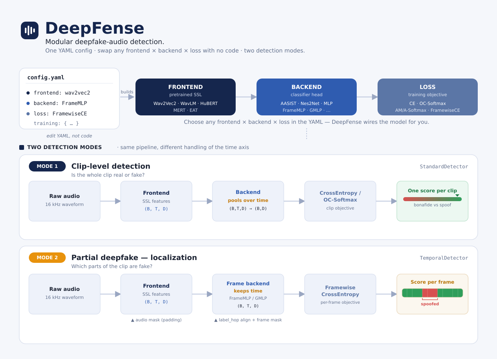

<div align="center">
  
</div>

<div align="center">

# DeepFense

**A Modular Framework for Deepfake Audio Detection (Clip-Level & Partial Deepfake)**

[](https://www.python.org/)
[](https://pytorch.org/)
[](LICENSE)

</div>

<div align="center">
  
</div>

---

## What is DeepFense?

DeepFense lets you build deepfake audio detectors by combining **frontends** (pretrained feature extractors), **backends** (classifiers), and **loss functions** — all defined in a single YAML config. No code changes needed to run new experiments.

It supports two detection modes:

| Mode | Task | Labels | Model | Backend | Output |
|------|------|--------|-------|---------|--------|
| **Clip-level** | Full-utterance bonafide vs spoof | One label per clip (`label`) | `StandardDetector` | Pooled backend (MLP, AASIST, Nes2Net, …) | One score per clip |
| **Partial deepfake / PartialSpoof** | Localize spoofed regions in time | Dense frame labels (`frame_labels`) | `TemporalDetector` | Frame backend (`FrameMLP`, `GMLP` with `pooling: none`) | One score per time step |

```
Clip-level:
  Raw Audio → Frontend → Backend (pools time) → CrossEntropy / OCSoftmax → clip score

Partial deepfake:
  Raw Audio → Frontend → Frame backend (keeps time) → FramewiseCrossEntropy → frame scores
                ↑                              ↑
         audio mask (padding)          label_hop alignment + frame_mask
```

**Reference config (annotated):** [`deepfense/config/experiments/temporal_deepfake_example.yaml`](deepfense/config/experiments/temporal_deepfake_example.yaml)

Ready-made PartialSpoof / HAD configs: `deepfense/config/experiments/PartialSpoof/` and `.../HAD/`.

---

## Install

```bash
conda create -n deepfense python=3.10
conda activate deepfense
pip install deepfense
```

Or install from source (for development):

```bash
conda create -n deepfense python=3.10
conda activate deepfense
cd DeepFense
pip install -e .
```

---

## Quick Start

### 1. Generate dummy test data

```bash
python tests/create_samples.py
```

### 2. Train (clip-level)

```bash
python train.py --config deepfense/config/train.yaml
```

### 2b. Partial deepfake / PartialSpoof (3 steps)

**Step 1 — Data.** Parquet with `path` + `frame_labels` (or `frame_labels_path`). See [Prepare data](#1-prepare-data).

**Step 2 — Train.**

```bash
deepfense train --config deepfense/config/experiments/temporal_deepfake_example.yaml
```

**Step 3 — Evaluate.** See [Evaluation metrics](#evaluation-metrics) (`RANGE_EER`, `SEGMENT_EER`, `MULTIRES_EER`).

Full config walkthrough (every YAML field): [Partial Deepfake / PartialSpoof](#partial-deepfake--partialspoof) below.

### 3. Test

**Clip-level:**

```bash
python test.py \
    --config deepfense/config/train.yaml \
    --checkpoint outputs/Wav2Vec2_Nes2Net_Example_*/best_model.pth
```

**Partial deepfake:**

```bash
deepfense test \
  --config deepfense/config/experiments/temporal_deepfake_example.yaml \
  --checkpoint outputs/TemporalDeepfake_Example_*/best_model.pth
```

Validation/test flattens all valid frames and computes metrics from `training.metrics`. See [Evaluation metrics](#evaluation-metrics).

### 4. Multi-GPU Training

DeepFense supports multi-GPU training out of the box via PyTorch DDP. Just use `torchrun`:

```bash
# 2 GPUs on a single node
torchrun --nproc_per_node=2 train.py --config deepfense/config/train.yaml

# 4 GPUs
torchrun --nproc_per_node=4 train.py --config deepfense/config/train.yaml
```

No config changes required -- DDP is detected automatically. Checkpoints, logs, and evaluation run on rank 0 only. The saved checkpoints are identical to single-GPU ones and can be loaded without any DDP-specific handling.

### 5. Use real data (clip-level)

Create a Parquet file with columns `ID`, `path`, `label` (`"bonafide"` / `"spoof"`), then update the config:

```yaml
data:
  train:
    parquet_files: ["/path/to/train.parquet"]
  val:
    parquet_files: ["/path/to/val.parquet"]
```

### 6. Use real data (partial deepfake)

Copy [`temporal_deepfake_example.yaml`](deepfense/config/experiments/temporal_deepfake_example.yaml) and follow the [config walkthrough](#config-walkthrough) below.

---

## Partial Deepfake / PartialSpoof

> **Start here:** copy [`deepfense/config/experiments/temporal_deepfake_example.yaml`](deepfense/config/experiments/temporal_deepfake_example.yaml), edit paths, run `deepfense train --config ...`.

Partial spoof = **localize spoofed frames**, not just classify the whole clip. Same YAML style as clip-level DeepFense, but different dataset, model, loss, and **evaluation** (including **Range EER**).

### How it differs from clip-level

| | Clip-level (`train.yaml`) | Partial spoof (`temporal_deepfake_example.yaml`) |
|--|---------------------------|--------------------------------------------------|
| Parquet | `path`, `label` | `path`, `frame_labels` or `frame_labels_path` |
| Dataset | `StandardDataset` | `TemporalSegmentationDataset` |
| Model | `StandardDetector` | `TemporalDetector` |
| Backend | Pools time → one vector (MLP, AASIST, …) | Keeps time → `FrameMLP` or `GMLP` (`pooling: none`) |
| Loss | CrossEntropy / OCSoftmax | `FramewiseCrossEntropy` |
| Eval | `EER`, `minDCF` | `FRAME_*`, **`SEGMENT_EER`**, **`RANGE_EER`**, **`MULTIRES_EER`** |

---

### Config walkthrough

Below follows the structure of [`temporal_deepfake_example.yaml`](deepfense/config/experiments/temporal_deepfake_example.yaml). **Clip-level difference** notes where a key does not exist in `train.yaml`.

#### `exp_name`, `output_dir`, `seed`

| Key | Example | Values | Clip-level? |
|-----|---------|--------|-------------|
| `exp_name` | `TemporalDeepfake_Example` | Any string; run folder = `{output_dir}/{exp_name}_{timestamp}/` | Same |
| `output_dir` | `./outputs/` | Directory for checkpoints, logs, plots | Same |
| `seed` | `42` | Integer RNG seed | Same |

#### `data:` — shared (all splits)

| Key | Example | Allowed / meaning | Clip-level? |
|-----|---------|-------------------|-------------|
| `sampling_rate` | `16000` | Audio Hz | Same |
| `label_hop_ms` | `40` | **Model output** frame period (ms). 40 ms = 640 samples @ 16 kHz | **Not used** |
| `label_hop` | `640` | Sample-based alias for `label_hop_ms` (use one or the other) | **Not used** |
| `source_label_hop_ms` | `20` | **Parquet annotation** rate. PartialSpoof = 20 ms | **Not used** |
| `source_label_hop` | `320` | Sample-based alias for `source_label_hop_ms` | **Not used** |
| `label_merge_rule` | `any_spoof` | When downsampling labels: `any_spoof` \| `all_spoof` \| `majority` \| `any_non_bonafide` | **Not used** |
| `label_map` | `{bonafide: 1, spoof: 0}` | String → int for clip + frame labels | Same |

**Timing rules:** `label_hop` must be a multiple of `source_label_hop` and of the SSL frontend hop (320 samples ≈ 20 ms for Wav2Vec2). `train.py` copies `label_hop*` into `model` automatically.

**Parquet columns**

| Column | Required | Format |
|--------|----------|--------|
| `path` | yes | Audio path |
| `frame_labels` **or** `frame_labels_path` | one required | Dense labels at `source_label_hop_ms` (see below) |
| `label` | no | Clip label; inferred from frames if omitted |
| `ID` | no | Utterance id (needed for multi-resolution EER) |

**`frame_labels` (inline in parquet)** — integer class indices (`0` = spoof, `1` = bonafide with default `label_map`). Supported cell formats:

| Format | Example |
|--------|---------|
| **List (recommended)** | `[1, 1, 0, 0, 1, 1]` as a parquet list column |
| Comma-separated string | `"1,1,0,0,1,1"` |
| JSON list string | `"[1, 1, 0, 0, 1, 1]"` |

Do **not** store `.npy` / `.npz` paths in `frame_labels` — use `frame_labels_path` instead.

**`frame_labels_path`** — path to a 1D `.npy` or `.npz` file (better for long utterances). If both columns are set on a row, **`frame_labels_path` is used**.

Label length = number of frames at **`source_label_hop_ms`** (e.g. PartialSpoof annotations @ 20 ms). See [`docs/temporal_deepfake.md`](docs/temporal_deepfake.md) for full schema examples.

#### `data.train` / `data.val` / `data.test`

| Key | Example | Allowed / meaning | Clip-level? |
|-----|---------|-------------------|-------------|
| `dataset_type` | `TemporalSegmentationDataset` | **Required** for partial spoof | Uses `StandardDataset` |
| `parquet_files` | list of paths | Train / val / test parquets | Same |
| `dataset_names` | `[Train]` | Tags for logging | Same |
| `root_dir` | `/data/audio` | Prefix for relative paths in parquet | Same |
| `max_len` | `64600` | Crop long clips (~4 s @ 16 kHz); labels sliced in sync | Usually uses `base_transform: pad` instead |
| `random_crop` | `true` / `false` | Train: random window; val/test: from start | **Partial only** |
| `max_frames` | `200` | Cap frame label length after crop | **Partial only** |
| `max_per_class` | `5000` | Subsample per class | Same |
| `batch_size` | `4` | Batch size | Same |
| `shuffle` | `true` / `false` | Shuffle (false for val/test) | Same |
| `num_workers` | `2` | DataLoader workers | Same |
| `base_transform` | `null` or list | Avoid `pad` + `max_len` together | Same |
| `augment_transform` | `null` or list | Train-only: RawBoost, RIR, codec, drop_chunk, … | Same |

#### `model:`

| Key | Example | Allowed / meaning | Clip-level? |
|-----|---------|-------------------|-------------|
| `type` | `TemporalDetector` | **Required** | `StandardDetector` |
| `pool_mode` | `mean` | Pool SSL features when `label_hop` > frontend hop: `mean` \| `max` | **Not used** |

**Frontend** (`model.frontend`)

| Key | Example | Allowed |
|-----|---------|---------|
| `type` | `wav2vec2` | `wav2vec2`, `wavlm`, `hubert` (recommended); `mert`, `eat` have limited mask/temporal support |
| `args.source` | `fairseq` | `fairseq` (local `.pt`) \| `huggingface` (model id) |
| `args.ckpt_path` | path or HF id | e.g. `xlsr2_300m.pt` or `facebook/wav2vec2-xls-r-300m` |
| `args.freeze` | `false` | `true` \| `false` |

**Backend** (`model.backend`) — must output `(batch, time, dim)`:

| `type` | Key args | Notes |
|--------|----------|-------|
| `FrameMLP` | `input_dim`, `projection`, `activation` (`relu`\|`selu`\|`tanh`\|`sigmoid`), `norm_type` (`layer`\|`batch`), optional `output_dim` | Default in example |
| `GMLP` | `input_dim`, `d_ffn` or `embed_dim` (negative = divide input dim), `seq_len`, `gmlp_layers`, **`pooling: none`**, `output_dim` | gMLP stack; `pooling: none` required for temporal |

**Loss** (`model.loss`)

| Key | Example | Allowed |
|-----|---------|---------|
| `type` | `FramewiseCrossEntropy` | Only loss wired for `(B, T, D)` today |
| `weight` | `1.0` | Loss weight |
| `embedding_dim` | `512` | Must match backend output dim |
| `n_classes` | `2` | Classes per frame |
| `ignore_index` | `-100` | Padded / invalid frames |
| `class_weights` | `[1.0, 1.0]` | Optional `[spoof, bonafide]` |
| `reduction` | `mean` | PyTorch CE reduction |

#### `training:`

| Key | Example | Allowed | Clip-level? |
|-----|---------|---------|-------------|
| `trainer` | `StandardTrainer` | Same trainer both modes | Same |
| `epochs` | `5` | Integer | Same |
| `device` | `cuda` | `cuda` \| `cpu` | Same |
| `batch_log_interval` | `10` | Log every N batches | Same |
| `eval_every_epochs` | `1` | Validate every N epochs | Same |
| `eval_every_steps` | `500` | Optional step-based eval | Same |
| `early_stopping_patience` | `10` | Stop after N evals without improvement | Same |
| `monitor_metric` | `FRAME_F1` | See [Evaluation](#evaluation-metrics) | Usually `EER` |
| `monitor_mode` | `max` | `max` for FRAME_*; `min` for EER metrics | Same logic |
| `optimizer.type` | `adam` | `adam`, `sgd`, … | Same |
| `optimizer.lr` | `1e-5` | Learning rate | Same |
| `optimizer.weight_decay` | `1e-4` | L2 penalty | Same |
| `scheduler` | `null` | `null` or `{type: cosine, …}` / `{type: exponential, gamma: 0.9}` | Same |
| `wandb` | `false` | `true` \| `false` | Same |

---

### Evaluation metrics

The model outputs **one score per frame**. All metrics below go under `training.metrics` and run on validation + `deepfense test`.

#### Tier 1 — Framewise (training feedback)

Good for `monitor_metric` while training. Use **`monitor_mode: max`**.

```yaml
metrics:
  FRAME_ACC: {}
  FRAME_F1: {f1_average: macro}    # macro | micro | weighted
  FRAME_AUC: {}
  FRAME_JACCARD_SPOOF: {spoof_label: 0}
```

| Metric | Meaning |
|--------|---------|
| `FRAME_ACC` | Accuracy on valid frames |
| `FRAME_F1` | F1 on frames |
| `FRAME_AUC` | ROC-AUC on frame scores |
| `FRAME_JACCARD_SPOOF` | Jaccard on spoof-frame detection |

Example: `monitor_metric: FRAME_F1`, `monitor_mode: max`

#### Tier 2 — PartialSpoof EER at native resolution

**`SEGMENT_EER`** and **`RANGE_EER`** are the protocol metrics added for partial spoof / localization. **Lower is better → `monitor_mode: min`.**

| Metric | What it measures |
|--------|------------------|
| **`SEGMENT_EER`** | Point-based segment EER — each frame is one trial (PartialSpoof diagonal / DIGEER) |
| **`RANGE_EER`** | **Range EER** — searches a threshold where frame-level false-alarm rate equals miss rate; measures **localization** quality |

```yaml
monitor_metric: RANGE_EER
monitor_mode: min
metrics:
  SEGMENT_EER: {}
  RANGE_EER:
    bonafide_label: 1      # default 1
    ignore_index: -100     # default -100
    prec: 0.0001           # bisection tolerance for range EER
    # precise: true        # also log RANGE_EER_threshold
```

#### Tier 3 — `MULTIRES_EER` (recommended for PartialSpoof)

Computes **`SEGMENT_EER`** and **`RANGE_EER`** at multiple frame lengths (20, 40, 80, 160 ms), like PartialSpoof SegmentEER upper-diagonal evaluation. Also logs **`UTTERANCE_EER`**.

```yaml
metrics:
  FRAME_F1: {f1_average: macro}
  MULTIRES_EER:
    bonafide_label: 1
    pool: min                        # min | max | mean
    label_merge_rule: any_spoof      # any_spoof | all_spoof | majority
    resolutions_ms: [20, 40, 80, 160]
    prec: 0.0001
    types: [segment, range, utterance]   # default: all three
```

**Keys written to logs / `results/`:**

| Key | Meaning |
|-----|---------|
| `SEGMENT_EER_20ms`, `SEGMENT_EER_40ms`, … | Segment EER at each resolution |
| `RANGE_EER_20ms`, `RANGE_EER_40ms`, … | **Range EER** at each resolution |
| `SEGMENT_EER_CONCAT_pct` | Segment EERs as `"3.4,4.1,…"` (percent) |
| `RANGE_EER_CONCAT_pct` | Range EERs as `"4.1,5.2,…"` (percent) |
| `UTTERANCE_EER` | Clip-level EER from pooled frame scores |

**Pick `monitor_metric` for best checkpoint:**

| Goal | `monitor_metric` | `monitor_mode` |
|------|------------------|----------------|
| Frame classification | `FRAME_F1` | `max` |
| Native range EER | `RANGE_EER` | `min` |
| Range EER @ 20 ms | `RANGE_EER_20ms` | `min` |
| Segment EER @ 40 ms | `SEGMENT_EER_40ms` | `min` |

---

### Commands

```bash
# Train
deepfense train --config deepfense/config/experiments/temporal_deepfake_example.yaml

# Test (runs all metrics in training.metrics)
deepfense test \
  --config deepfense/config/experiments/temporal_deepfake_example.yaml \
  --checkpoint outputs/TemporalDeepfake_Example_*/best_model.pth
```

**Preset configs:** `experiments/PartialSpoof/` (20 ms hop), `experiments/HAD/`, or the example above (20 ms annotate → 40 ms predict).

---
## How Configuration Works

Everything is controlled by a single YAML file. Here is the anatomy:

```yaml
# ---------- experiment ----------
exp_name: "my_experiment"
output_dir: "./outputs/"
seed: 42

# ---------- data ----------
data:
  sampling_rate: 16000
  label_map: {"bonafide": 1, "spoof": 0}
  train:
    parquet_files: ["train.parquet"]
    batch_size: 32
    base_transform:
      - type: "pad"
        max_len: 64600          # ~4 sec at 16 kHz
    augment_transform:          # training only
      - type: "rawboost"
        noise_ratio: 0.4
  val:
    parquet_files: ["val.parquet"]
    batch_size: 64
    base_transform:
      - type: "pad"
        max_len: 64600

# ---------- model ----------
model:
  type: "StandardDetector"
  frontend:
    type: "wav2vec2"                    # or wavlm, hubert, mert, eat
    args:
      source: "huggingface"             # or "fairseq" for local .pt files
      ckpt_path: "facebook/wav2vec2-xls-r-300m"
      freeze: True
  backend:
    type: "AASIST"                      # or MLP, Nes2Net, ECAPA_TDNN, RawNet2
    args:
      input_dim: 1024                   # must match frontend output dim
  loss:
    - type: "OCSoftmax"                 # or CrossEntropy, AMSoftmax, ASoftmax
      weight: 1.0
      embedding_dim: 32                 # must match backend output dim

# ---------- training ----------
training:
  epochs: 50
  device: "cuda"
  optimizer:
    type: "adam"
    lr: 0.0001
  scheduler:
    type: "cosine_annealing"
    T_max: 50
  monitor_metric: "EER"
  monitor_mode: "min"
  metrics:
    EER: {}
    ACC: {}
    minDCF: {Pspoof: 0.05}
```

See the [Full Tutorial](docs/03_full_tutorial.md) for a detailed walkthrough of every parameter.

---

## Available Components

| Category | Options |
|----------|---------|
| **Detectors** | `StandardDetector` (clip-level), `TemporalDetector` (partial deepfake) |
| **Datasets** | `StandardDataset`, `TemporalSegmentationDataset` |
| **Frontends** | Wav2Vec2, WavLM, HuBERT, MERT, EAT |
| **Backends (clip)** | AASIST, ECAPA-TDNN, Nes2Net, RawNet2, MLP, TCM |
| **Backends (temporal)** | **FrameMLP**, **GMLP** (`pooling: none`) |
| **Losses** | CrossEntropy, OC-Softmax, AM-Softmax, A-Softmax, **FramewiseCrossEntropy** |
| **Augmentations** | RawBoost, RIR, Codec, AdditiveNoise, SpeedPerturb, AddBabble, DropChunk, DropFreq |
| **Metrics (clip)** | EER, minDCF, actDCF, ACC, F1 |
| **Metrics (partial)** | FRAME_ACC, FRAME_F1, FRAME_AUC, FRAME_JACCARD_SPOOF, **SEGMENT_EER**, **RANGE_EER**, **MULTIRES_EER**, UTTERANCE_EER |

List them from the CLI:

```bash
deepfense list
deepfense list --component-type backends
```

---

## Pretrained Models & Datasets (HuggingFace Hub)

DeepFense publishes **455+ pretrained models** and **12 datasets** at [huggingface.co/DeepFense](https://huggingface.co/DeepFense).

```bash
# See what's available
deepfense download list-datasets
deepfense download list-models --filter WavLM

# Download a dataset (parquet files)
deepfense download dataset CompSpoof

# Download a pretrained model (checkpoint + config)
deepfense download model ASV19_WavLM_Nes2Net_NoAug_Seed42

# Test the downloaded model
python test.py \
    --config models/ASV19_WavLM_Nes2Net_NoAug_Seed42/config.yaml \
    --checkpoint models/ASV19_WavLM_Nes2Net_NoAug_Seed42/best_model.pth
```

Or in Python:

```python
from deepfense.hub import download_dataset, download_model

parquets = download_dataset("CompSpoof")           # returns list of local paths
files    = download_model("ASV19_WavLM_Nes2Net_NoAug_Seed42")  # returns {"checkpoint": ..., "config": ...}
```

See the [HuggingFace Hub Guide](docs/07_huggingface_hub.md) for full workflows (training, evaluation, inference).

---

## Adding Your Own Component

Every component type follows the same pattern:

1. Create a file (e.g. `deepfense/models/backends/my_backend.py`)
2. Decorate with the registry:
   ```python
   from deepfense.utils.registry import register_backend
   from deepfense.models.base_model import BaseBackend

   @register_backend("MyBackend")
   class MyBackend(BaseBackend):
       def __init__(self, config):
           super().__init__()
           # ...

       def forward(self, x):
           # ...
   ```
3. Import it in the package `__init__.py`
4. Use it in your config:
   ```yaml
   backend:
     type: "MyBackend"
     args: { ... }
   ```

The same pattern applies to frontends, losses, augmentations, datasets, optimizers, and metrics. See the [user guides](docs/user_guide/) for detailed walkthroughs.

---

## Project Structure

```
DeepFense/
├── train.py, test.py          # Entry points
├── deepfense/
│   ├── cli/                   # CLI commands (train, test, list, download)
│   ├── config/                # YAML configs + parquet generators
│   │   └── experiments/       # temporal_deepfake_example.yaml, PartialSpoof/, HAD/
│   ├── data/
│   │   ├── detection_dataset.py      # StandardDataset (clip-level)
│   │   ├── temporal_dataset.py       # TemporalSegmentationDataset (partial deepfake)
│   │   ├── temporal_utils.py         # Frame label alignment / downsampling
│   │   └── transforms/               # Augmentations, RawBoost, audio utils
│   ├── models/
│   │   ├── detector.py               # StandardDetector
│   │   ├── temporal_detector.py      # TemporalDetector
│   │   ├── frontends/                # Wav2Vec2, WavLM, HuBERT, MERT, EAT
│   │   ├── backends/                 # AASIST, MLP, FrameMLP, ...
│   │   ├── losses/                   # CrossEntropy, FramewiseCrossEntropy, ...
│   │   └── modules/                  # Shared layers (pooling, conformer, fairseq_local)
│   ├── training/              # Trainer, evaluator, metrics, seed
│   └── utils/                 # Registry, visualization, optional trace helpers
├── docs/
│   └── temporal_deepfake.md   # Partial deepfake design & config reference
└── scripts/                   # Data prep, prediction export, analysis
```

---

## Documentation

| Guide | Description |
|-------|-------------|
| [Installation](docs/01_installation.md) | Setup instructions |
| [Quick Start](docs/02_quickstart.md) | First model in 5 minutes |
| [Full Tutorial](docs/03_full_tutorial.md) | Every config option explained |
| [Architecture](docs/04_architecture.md) | How DeepFense works internally |
| [Configuration Reference](docs/05_configuration.md) | All YAML parameters |
| [Library Usage](docs/06_library_usage.md) | Use DeepFense as a Python library |
| [HuggingFace Hub](docs/07_huggingface_hub.md) | Download datasets & pretrained models |
| [**Temporal / Partial Deepfake**](docs/temporal_deepfake.md) | Design notes, parquet schema, limitations |
| [CLI Reference](docs/cli_reference.md) | CLI commands |
| [Components](docs/components/) | Frontend, backend, loss, augmentation reference |
| [User Guides](docs/user_guide/) | Adding custom components, training workflows |

---

## Citation

```bibtex
@software{deepfense2025,
  title={DeepFense: A Modular Framework for Deepfake Audio Detection},
  author={DeepFense Team},
  year={2025},
  url={https://github.com/Yaselley/deepfense-framework}
}
```

## License

Apache 2.0 -- see [LICENSE](LICENSE) for details.
