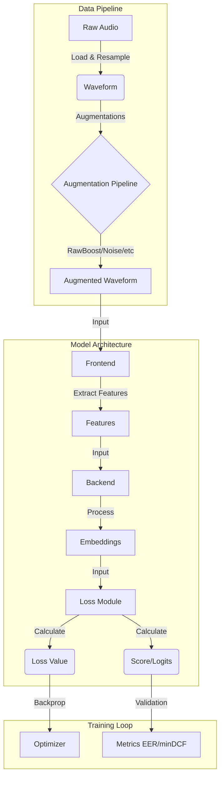

# DeepFense Architecture

This document provides a detailed overview of the DeepFense framework's architecture, explaining how data flows from input audio to the final detection score.

## 🏗️ System Skeleton

DeepFense is built on a modular design pattern where every major component (Frontend, Backend, Loss) is interchangeable via configuration.

### High-Level Data Flow



### Component Responsibilities

#### 1. Data Pipeline (`deepfense/data`)
*   **StandardDataset**: Reads metadata from Parquet files. It handles label mapping (Bonafide/Spoof -> 1/0).
*   **AugmentationPipeline**: A flexible system that can run augmentations in:
    *   **Sequential**: Apply A, then B, then C.
    *   **Parallel (OneOf)**: Randomly pick one from [A, B, C].
    *   **Concat**: Produce multiple versions of the same audio (Original + Aug1 + Aug2) to train on all simultaneously.
*   **CollateFn**: Handles padding of audio to `max_len` or the longest in the batch, and creates boolean masks (1 for valid, 0 for padding).

#### 2. The Detector (`deepfense/models/detector.py`)
The `StandardDetector` is the central `nn.Module`. It doesn't implement logic itself but acts as a container/orchestrator.
*   **Input**: Batch of audio `[B, T]`
*   **Frontend**: Converts Audio `[B, T]` -> Features `[B, C, F, T']` (e.g., Wav2Vec2, MelSpectrogram).
*   **Backend**: Converts Features `[B, C, F, T']` -> Fixed-size Embedding `[B, D]` (e.g., AASIST, ResNet, MLP).
*   **Loss**: Takes Embeddings `[B, D]` and Labels `[B]` -> Computes Loss and Scores.

#### 3. The Trainer (`deepfense/training`)
*   **StandardTrainer**: Manages the training loop, checkpointing, logging (WandB/Console), and evaluation.
*   **Evaluator**: Computes EER (Equal Error Rate) and minDCF (Minimum Detection Cost Function) at the end of epochs.

---

## 🧩 Directory Structure Explained

```text
DeepFense/
├── deepfense/
│   ├── config/           # ⚙️ YAML Configuration
│   │   ├── train.yaml    # The "Main" config file users interact with
│   │   └── ...
│   ├── data/             # 💾 Data Handling
│   │   ├── detection_dataset.py  # Dataset implementation
│   │   └── transforms/           # Augmentation logic (RawBoost, etc.)
│   ├── models/           # 🧠 Neural Networks
│   │   ├── detector.py   # The main wrapper class
│   │   ├── frontends/    # wav2vec2.py, wavlm.py (Feature Extractors)
│   │   ├── backends/     # aasist.py, mlp.py (Classifiers)
│   │   └── losses/       # am_softmax.py, cross_entropy.py
│   ├── training/         # 🏋️ Loop Logic
│   │   ├── standard_trainer.py # Training loop implementation
│   │   └── evaluations/  # EER/minDCF calculation code
│   └── utils/            # 🛠️ Registry & Helpers
│       └── registry.py   # Decorators that make the config magic work
├── docs/                 # 📚 You are here
├── outputs/              # 📂 Results (Logs, Checkpoints, Plots)
├── train.py              # 🚀 Entry point for training
└── test.py               # 🧪 Entry point for inference
```
