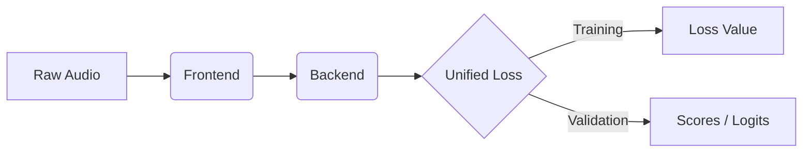

# Architecture Overview

DeepFense uses a **Modular Architecture** designed for flexibility and rapid experimentation.

## The `ModularDetector`

The core of the framework is the `ModularDetector` class (`deepfense/models/detector.py`). It acts as a container that wires together three interchangeable parts:

1.  **Frontend**: Audio $\to$ Features (inherits `BaseFrontend`)
2.  **Backend**: Features $\to$ Embeddings (inherits `BaseBackend`)
3.  **Unified Loss**: Embeddings $\to$ Loss & Scores (inherits `BaseLoss`)

### Key Design Decisions

1.  **Registry System**:
    *   Instead of hardcoding imports, we use a registry (`deepfense.utils.registry`).
    *   You define a component type in YAML (e.g., `type: "AASIST"`), and the registry finds the corresponding class.

2.  **Unified Loss Modules**:
    *   In many frameworks, the "projection layer" (Linear, ArcFace, etc.) is separate from the "Loss function" (CrossEntropy).
    *   In DeepFense, we **merge** them. The `AMSoftmax` module contains *both* the `AMAngleLayer` (projection) and the `CrossEntropy` logic.
    *   **Benefit**: This simplifies the main model code. The Detector just produces embeddings, and the Loss module handles the rest.

3.  **Loss-Dependent Scoring**:
    *   Different losses require different scoring logic for evaluation (e.g., EER).
    *   **CrossEntropy**: Score = Logit(Bonafide).
    *   **AMSoftmax**: Score = Logit(Bonafide) - Logit(Spoof).
    *   **OCSoftmax**: Score = Cosine Similarity.
    *   DeepFense automatically detects the loss type and adjusts the scoring metric accordingly.

## Data Flow

1.  **Input**: A batch of audio samples `x` and labels `y`.
2.  **Forward Pass**:
    *   `feat = frontend(x)`
    *   `emb = backend(feat)`
    *   `outputs = {"embeddings": emb}`
    *   **Validation Only**: `outputs["scores"] = loss_module.get_logits(emb)`
3.  **Loss Computation**:
    *   `loss = loss_module(emb, y)`
4.  **Optimization**:
    *   Standard backpropagation on `loss`.

