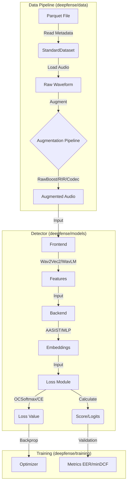

# DeepFense Architecture

This document details the modular architecture of DeepFense, explaining the data flow from raw audio input to the final spoofing detection score.

## 🏗️ System Skeleton

DeepFense is built on a **Registry Pattern**. Every major component (Frontend, Backend, Loss, Transform) is registered via decorators (e.g., `@register_frontend`) and instantiated dynamically based on the YAML configuration.

### High-Level Data Flow



## 🧩 Component Responsibilities

### 1. Data Pipeline (`deepfense/data`)

*   **StandardDataset**: Reads metadata from Parquet files. It handles label mapping (`bonafide` -> 1, `spoof` -> 0).
*   **AugmentationPipeline**: A flexible system that can run augmentations in:
    *   **Sequential**: Apply A, then B, then C.
    *   **Parallel (OneOf)**: Randomly pick one from [A, B, C].
    *   **Concat**: Produce multiple versions of the same audio (Original + Aug1 + Aug2) to train on all simultaneously.
*   **CollateFn**: Handles padding of audio to `max_len` or the longest in the batch.

### 2. The Detector (`deepfense/models/detector.py`)

The `StandardDetector` is the central `nn.Module`. It acts as a container:
*   **Frontend**: Converts Audio `[B, T]` $\rightarrow$ Features `[B, C, F, T']` (e.g., Wav2Vec2, MelSpectrogram).
*   **Backend**: Converts Features $\rightarrow$ Fixed-size Embedding `[B, D]` (e.g., AASIST, ResNet, MLP).
*   **Loss**: Takes Embeddings `[B, D]` and Labels `[B]` $\rightarrow$ Computes Loss and Scores.

### 3. The Trainer (`deepfense/training`)

*   **StandardTrainer**: Manages the training loop, checkpointing, logging (WandB/Console), and evaluation.
*   **Evaluator**: Computes EER (Equal Error Rate) and minDCF (Minimum Detection Cost Function) at the end of epochs.

## Directory Structure

```text
DeepFense/
├── deepfense/
│   ├── config/           # ⚙️ YAML Configuration
│   ├── data/             # 💾 Data Handling (Datasets, Transforms)
│   ├── models/           # 🧠 Neural Networks
│   │   ├── detector.py   # Main Wrapper
│   │   ├── frontends/    # Feature Extractors
│   │   ├── backends/     # Classifiers
│   │   └── losses/       # Loss Functions
│   ├── training/         # 🏋️ Training Loop & Evaluators
│   └── utils/            # 🛠️ Registry & Helpers
├── docs/                 # 📚 Documentation
├── outputs/              # 📂 Results
├── train.py              # 🚀 Training Entry Point
└── test.py               # 🧪 Inference Entry Point
```
